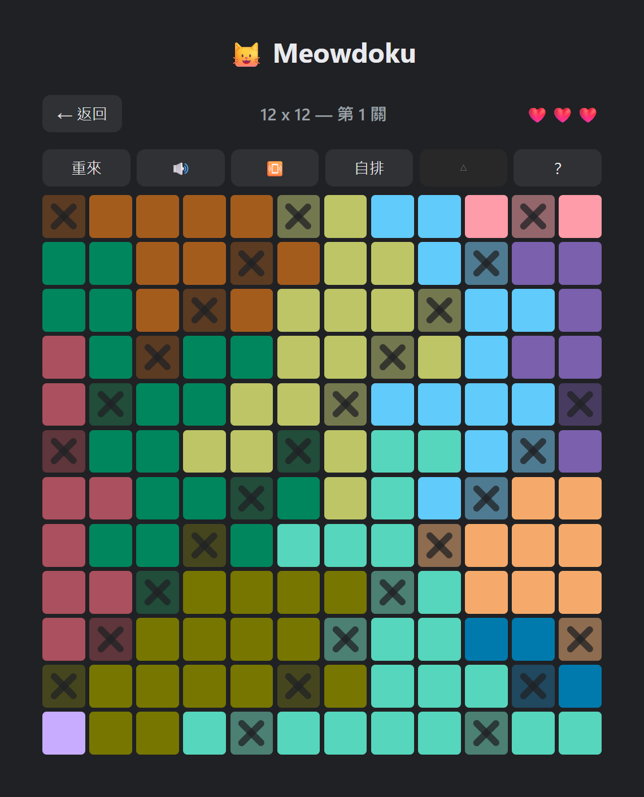

  

# Meowdoku Restyle

A Chrome extension that restyles <https://yocox.github.io/meowdoku/>. It changes
nothing about the rules or the logic, only how the board looks.

## What it changes

1. **Less rounded cells, scaled to the board.** The page gives every cell a
   flat 10px radius, round enough that a run of same-colour cells reads as
   separate blobs rather than one region — and one cat per region is the rule
   being read. Replaced with 10% of the cell's own width: 4px at 12 x 12, 6px
   at 8 x 8, 8.5px at 6 x 6. A flat value cannot suit every board, because a
   cell is 40px wide at 12 x 12 and 85px at 6 x 6, so the page's 10px is a
   quarter of the small cell and an eighth of the large one — it gets less
   round exactly where cells get bigger. A percentage holds one shape at every
   size.
2. **Crossed-out cells are dimmed in OKLab.** A cell marked with an X gets a
   recoloured background: same hue, lightness scaled to 70% and chroma scaled
   to 50%, computed in OKLab rather than with a CSS `filter`. `filter:
   brightness() saturate()` runs in sRGB, so on the palette's pale ring it
   reads as a flat grey wash rather than a dimmed version of the same colour.
   OKLab separates lightness from chroma along perceptual axes, so scaling
   each on its own keeps the hue intact and keeps a crossed-out cell
   recognisable as its region.
3. **A twelve-colour region palette**, replacing the site's own. Two rings —
   6+6 by default, from `D:\palette-lab\results\6+6-sharedC.json`, or 5+7,
   from `D:\palette-lab\results\5+7-sharedC.json` — assigned to region ids with a
   stride of 7 rather than in array order. game.js hands out ids in order,
   and each palette walks its rings in hue order, so assigning it straight
   would put adjacent hues on adjacent ids. Stepping by 7 (coprime with the
   12-colour palette) spaces consecutive ids 5 slots apart every time, which
   a per-game random shuffle can't promise.
4. **A palette picker in the extension's popup.** Click the extension icon
   to switch between the palettes above; the choice is saved and repaints
   any open game tab immediately.

## How a region is recognised

`game.js` writes each region's colour as an inline style and keeps its
palette in a top-level `const`, which never reaches `window`. So there is
nothing to patch: the extension reads each cell's inline colour back, looks
it up in `ORIGINAL_PALETTES`, and overwrites it.

That makes the site's palette a hard dependency. `ORIGINAL_PALETTES` holds
the current palette and the one it replaced in a September 2026 update, so a
browser still serving a cached `game.js` works too.

**If regions stop being recoloured after a site update, check this first.**
Diff `REGION_COLORS` in `game.js` against `ORIGINAL_PALETTES` and prepend the
new array.

## Install

1. Open `chrome://extensions`.
2. Turn on **Developer mode** (top right).
3. Click **Load unpacked** and pick this folder.
4. Reload the game tab.

## Tuning

`restyle.css` holds `--md-radius` (cell corner radius, 10% of cell width
against the page's flat 10px).

`palettes.js` holds `PALETTES`, the named colour sets offered in the popup,
and `DEFAULT_PALETTE_KEY`. Add an entry there to offer another palette — no
change to `restyle.js` or `popup.js` needed.

`restyle.js` holds `PALETTE_STRIDE`, the step used to spread a palette's
colours across region ids, and `MD_MARK_LIGHTNESS` / `MD_MARK_CHROMA`, the
OKLab scale factors applied to a region's colour for its crossed-out state.

Three rules carry the cell radius — the cell itself, the hover/press overlay
and the wrong-guess overlay — and the stylesheet moves all three together.
The page used `border-radius: inherit` on the overlays until a September 2026
update replaced it with a literal 10px, so they no longer follow the cell on
their own.

The radius is a percentage so it resolves against the cell's own box and
tracks cell size. Container query units are the wrong tool here even though
the page uses them for icon sizing: `.cell` is itself the query container, and
cq units resolve against an ancestor container, not the element declaring
them.

## Playing a local copy

`manifest.json` matches `https://yocox.github.io/meowdoku/*` only. To use it
against a local checkout, add that origin to `content_scripts[0].matches`,
e.g. `"http://localhost:8000/*"`.
